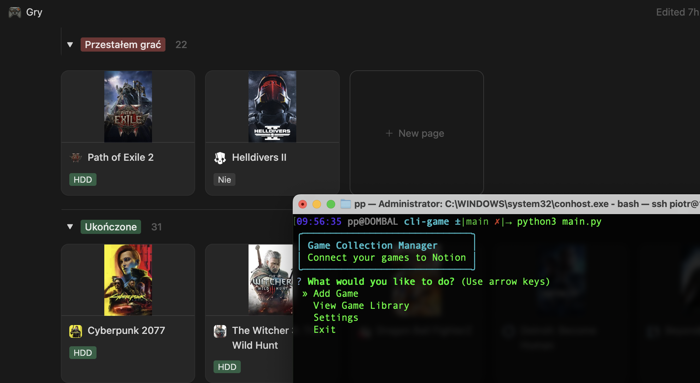

[Watch video](https://github.com/ppogorze/notion-game-tracker-steamgriddb/raw/main/images/video.mp4)

# Game Collection Manager

A Python CLI application to manage your game collection by connecting SteamGridDB and Notion.

## Features

- Search for games on SteamGridDB
- Add games to your Notion database automatically
- Set games with proper icons and cover images
- Interactive CLI interface
- **Game Library Management:**
  - List all games in your collection
  - Search your game library
  - Edit existing games (name, release year, icons, and covers)
  - Delete games from your collection

## Requirements

- Python 3.7+
- SteamGridDB API key
- Notion integration token and database ID

## Installation

1. Create (free) Notion account and copy this [template](https://struktura.notion.site/Gry-1cfc923134f380a3b534dd19e5af239b?pvs=4)

2. Clone the repository:
```
git clone https://github.com/yourusername/game-collection-manager.git
cd game-collection-manager
```

3. Install dependencies:
```
pip install notion-client questionary rich requests
```

## Configuration

Before using the application, you need to set up your API keys:

1. **SteamGridDB API Key**: 
   - Create an account at [SteamGridDB](https://www.steamgriddb.com/)
   - Go to your profile and generate an API key

2. **Notion Integration**:
   - Go to [Notion Integrations](https://www.notion.so/my-integrations)
   - Create a new integration and copy the secret token
   - Share your database with the integration

3. **Notion Database ID**:
   - Open your Notion database
   - Copy the URL, which contains the database ID
   - The app will extract the ID from the URL

## Usage

Run the application:
```
python main.py
```

The application provides the following options:
1. **Add Game**: Search for a game and add it to your Notion database
2. **View Game Library**: Manage your existing game collection
   - List all games with pagination
   - Search for specific games
   - Edit game information and assets
   - Delete games from your collection
3. **Settings**: Configure your API keys and database ID

## Example

1. Run the application
2. Select "Settings" to configure your API keys and database ID
3. Select "Add Game" and enter a game name
4. Choose from the search results
5. The game will be added to your Notion database with proper icon and cover image

## License

MIT License
